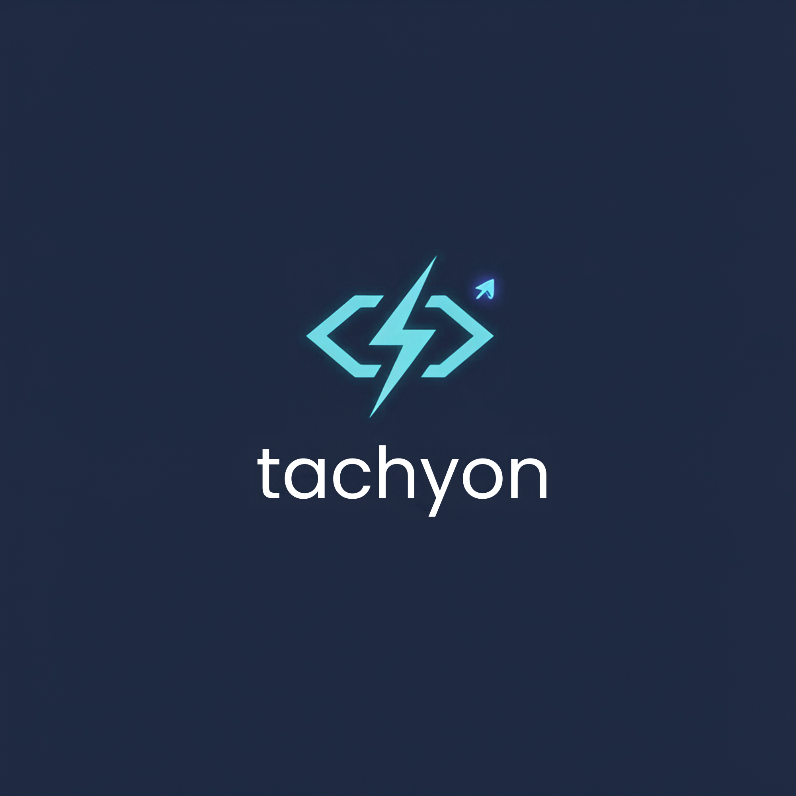

<p align="center">
  
</p>

# tachyon-sdk

Official client libraries for [Tachyon](https://github.com/adikeshri/tachyon),
the open-source, typo-tolerant full-text search engine.

All five SDKs are thin, fully-typed wrappers over Tachyon's JSON/HTTP API —
same resources, same error codes, same defaults, in idiomatic
TypeScript, Python, Go, C#, and Java. See
[`docs/api.md`](https://github.com/adikeshri/tachyon/blob/main/docs/api.md)
in the main repo for the underlying API reference every one of them is
built on.

| | |
|---|---|
| [**TypeScript / JavaScript**](typescript) | `npm install tachyon-sdk` — Node 18+, ESM |
| [**Python**](python) | `pip install tachyon-sdk` — Python 3.8+ |
| [**Go**](go) | `go get github.com/adikeshri/tachyon-sdk/go` — Go 1.21+ |
| [**C# / .NET**](csharp) | `dotnet add package Tachyon.Sdk` — .NET 8+ |
| [**Java**](java) | `io.github.adikeshri:tachyon-sdk` (Maven) — Java 17+ |

## Quickstart

Start a Tachyon server ([Docker Hub](https://hub.docker.com/r/adikeshri/tachyon)):

```bash
docker run -p 8108:8108 adikeshri/tachyon
```

TypeScript:

```ts
import { Tachyon } from 'tachyon-sdk';

const client = new Tachyon({ url: 'http://localhost:8108' });

await client.collections.create({
  name: 'products',
  fields: [{ name: 'title', type: 'text' }],
});
await client.collection('products').documents.index({ id: '1', title: 'Wireless Mouse' });
const results = await client.collection('products').search({ q: 'wireless mouse' });
```

Python:

```python
from tachyon_sdk import Tachyon

client = Tachyon(url="http://localhost:8108")

client.collections.create({"name": "products", "fields": [{"name": "title", "type": "text"}]})
client.collection("products").documents.index({"id": "1", "title": "Wireless Mouse"})
results = client.collection("products").search(q="wireless mouse")
```

Go:

```go
client := tachyon.NewClient("http://localhost:8108")

client.Collections.Create(ctx, tachyon.CollectionSchema{
    Name:   "products",
    Fields: []tachyon.FieldSchema{{Name: "title", Type: tachyon.FieldTypeText}},
})
client.Collection("products").Documents.Index(ctx, tachyon.Document{"id": "1", "title": "Wireless Mouse"})
results, err := client.Collection("products").Search(ctx, tachyon.SearchParams{Q: "wireless mouse"})
```

C#:

```csharp
var client = new TachyonClient(new TachyonClientOptions { Url = "http://localhost:8108" });

await client.Collections.CreateAsync(new CollectionSchema
{
    Name = "products",
    Fields = [new FieldSchema { Name = "title", Type = FieldType.Text }],
});
await client.Collection("products").Documents.IndexAsync(new Document { ["id"] = "1", ["title"] = "Wireless Mouse" });
var results = await client.Collection("products").SearchAsync(new SearchParams { Q = "wireless mouse" });
```

Java:

```java
var client = TachyonClient.builder("http://localhost:8108").build();

client.collections.create(CollectionSchema.builder("products")
    .fields(FieldSchema.builder("title", FieldType.TEXT).build())
    .build());
client.collection("products").documents().index(new Document().set("id", "1").set("title", "Wireless Mouse"));
var results = client.collection("products").search(SearchParams.builder().q("wireless mouse").build());
```

Full usage — client options, every resource, error handling — is documented
in each SDK's own README: [`typescript/README.md`](typescript/README.md),
[`python/README.md`](python/README.md), [`go/README.md`](go/README.md),
[`csharp/README.md`](csharp/README.md), [`java/README.md`](java/README.md).

## What's covered

All five clients cover the whole of Tachyon's HTTP API:

- **Collections** — create, list, retrieve, delete
- **Documents** — index (upsert), retrieve, delete
- **Search** — full parameter set (`filter`, `sort`, `facet`, pagination,
  prefix, typo tolerance, match mode), including `found_is_exact` for
  block-max WAND pruning
- **Autocomplete** — `suggest`
- **Analytics** — top queries, zero-result queries, latency percentiles
- **Operations** — `health`, `metrics`

All five map every documented error code (`invalid_schema`, `unauthorized`,
`collection_not_found`, ...) onto a typed error/exception carrying the
server's `code` and HTTP `status`, and distinguish API errors from
connection/timeout failures.

Every SDK also ships an integration suite that exercises all of the above
against a real, running Tachyon server (not mocks) — see each SDK's README
for how to run it locally.

## Repository layout

```text
typescript/   npm package "tachyon-sdk"
python/       PyPI package "tachyon-sdk" (import tachyon_sdk)
go/           Go module "github.com/adikeshri/tachyon-sdk/go" (import as tachyon)
csharp/       NuGet package "Tachyon.Sdk"
java/         Maven artifact "io.github.adikeshri:tachyon-sdk"
```

Each is independently versioned, tested, and released via its own
tag-triggered GitHub Actions pipeline — see [`RELEASING.md`](RELEASING.md)
for how a release actually ships for each (npm, PyPI, and NuGet are built
once and promoted, gated by environment approval; Maven Central signs and
deploys directly; Go has no publish step at all — the git tag itself is the
release).

## Contributing

Issues and pull requests are welcome. For the server itself, see
[adikeshri/tachyon](https://github.com/adikeshri/tachyon).

## License

Apache 2.0. See [`LICENSE`](LICENSE).
